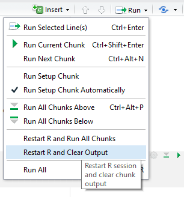

Rstudio le permite crear diferentes tipos de archivos: RScript, R Notebook, R Markdown, Shinny Web App. Nosotros vamos a utilizar principalmente archivos R Markdown y RScript.

Un archivo RScript es un archivo que simplemente guarda código de R. Normalmente estos archivos tienen una extensión *.R*.

Esto porque se puede combinar texto con código dentro del mismo archivo. El código puede ser insertado añadiendo 

Mientras que un [archivo Markdown](http://rmarkdown.rstudio.com/) es una combinación entre bloques de texto con *bloques de código* de R. Normalmente estos archivos tienen una extensión *.Rmd*. La diferencia principal es que de un archivo R Markdown se puede crear un reporte, que es reproducible, reutilizable y fácil de modificar; mientras que de un archivo de R Script no, es solo código. La siguiente figura muestra todos los tipos de archivos que pueden ser creados.


<center>

</center>


También puede ver los tipos de documentos desde la pestaña *Files*:

<center>


</center>


**Nota:** Si crea un archivo nuevo, para que su computadora pueda leer tildes y caracteres no ingleses deberá guardar el archivo en File --> "Save with encoding"--> UTF-8 y después compilarlo. El encoding por default de R no es UTF-8.

Antes de empezar, asegúrese que ha descargado los archivos de la [sesión 1](https://github.com/conciclicboy/UCAanalytics/tree/master/Sesiones/Sesiones_1_2_Intro_R)  en su repositorio de github (si descarga el repositorio del curso desde github usted también descarga las sesiones automáticamente). Para confirmar, usted también puede correr el archivo "update_fork.R" el cual se encuentra en el directorio principal del curso.


### R Script
Para crear un archivo R Script de click el botón de RScript, eso desplegará un archivo en blanco en el que usted puede escribir código de R.

Dentro de un archivo R, usted puede escribir comentarios para documentar o describir lo que significa el código añadiendo el signo *#* al inicio de cada línea.
Para añadir código simplemente empieza a escribir.

<center>

</center>

Para ejecutar las dos líneas de código se sombrea la parte que se quiere ejecutar y se da click en run.

<center>

</center>

Usted notará que la consola de R no mostrará un resultado cuando encuentre un comentario.

### R Markdown

Para crear un archivo R Markdown de click en R Markdown de la figura anterior. Eso desplegará una nueva ventana donde debe indicar el tipo de archivo que desea compilar.

<center>
{width=500px}
</center>

Usted deberá seleccionar HTML o un documento word porque no necesitan de instalaciones adicionales, si quiere un documento pdf deberá instalar LaTex que es un procesador de texto científico. Mi recomendación es que utilicen un HTML por facilidad. Al seleccionarlo debe añadir un nombre y dar click ok.

Eso abrirá una plantilla de archivo R Markdown que contiene texto en inglés
y código R. Para crear un reporte HTML usted va dar click en el botón que dice Knit.

<center>
{width=500px}
</center>

Se desplegará una pantalla para que usted guarde el archivo R Markdown. Después de elegir un nombre el archivo comenzará a compilar,ejecuta fusionando perfectamente los bloques de texto como los bloques de código R. Al final se creará un documento HTML que se puede abrir en el explorador de internet.

<center>
{width=500px}

</center>


Los archivos R Markdown tienen 2 partes, una que sale en blanco y otra que sale en gris. La parte en gris siempre va estar atrapada entre 3 símbolos que parecen tildes invertidas *```* al inicio y al final y unas llaves después del primer bloque *{ }*.

<center>
{width=400px}
</center>

Para insertar un bloque de código R usted puede hacerlo manualmente o seleccionando la siguiente opción de RStudio:

<center>
{width=400px}
</center>

La cual generará el siguiente código

<center>
{width=400px}
</center>


Es importante mencionar que se puede ejecutar lo que hay al interior de un archivo R Markdown sin compilar el reporte completo. Solamente se debe dar click en el símbolo de correr para ejecutar el bloque de código actual. Si se da click en la flecha que apunta hacia abajo se ejecutarán todos los bloques de código después del bloque actual. Esto es muy útil si se quiere revisar o visualizar parte del análisis a la mitad del proceso.

<center>
{width=400px}
</center>


### Error frecuente al compilar

Frecuentemente el programa experimenta un error con el botón de knit (que se utiliza para compilar). Normalmente usted podrá desplegar una lista con los tipos de reporte que puede generar un archivo R Markdown: 

<center>
{width=500px}
</center>

Sin embargo, en ocasiones, después de compilar el archivo la lista desplegable del botón knit desaparece y solo se ve el botón, el cual, al ser presionado muestra un documento en blanco.

<center>
{width=500px}
</center>

Este es un problema de RStudio, la solución consiste en remover manualmente el archivo .RData que se encuentra en el directorio.

<center>
{width=350px}
</center>


Una vez usted ha borrado ese archivo procederá a cerrar y reiniciar R (o Restart R and Clear Output), después de esto la lista desplegable volverá a aparecer y el archivo compilará correctamente.

<center>
{width=300px}
</center>


### Error por Actualización

También se puede dar el caso que las librerías ya no estén disponibles para la versión de R que usted maneja. Por ejemplo, la librería glmnet (que usted instala cuando ejecuta el archivo library.R) solo está disponible para versiones de R >= 3.6.0 ya que se actualizó en diciembre 2019. Vea la documentación de [glmnet](https://cran.r-project.org/web/packages/glmnet/glmnet.pdf).

Si usted tiene una versión de R menor a 3.6.0 le aparecerá el siguiente error:

<center>
{width=500px}
</center>

<br>

Lo que quiere decir que el instalador de librerías no funcionó como debía ser. Si intentamos instalar la librería de forma manual obtenemos el siguiente error:

<center>
{width=400px}
</center>

<br>

Eso indica que para reparar el error debemos actualizar R.
Para actualizar R instalaremos la librería **installr**, llamaremos a la librería **library(installr)** y ejecutaremos la función **updateR()**.


