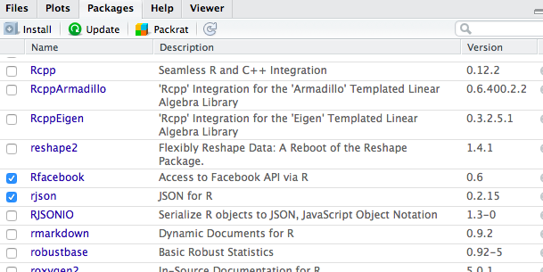
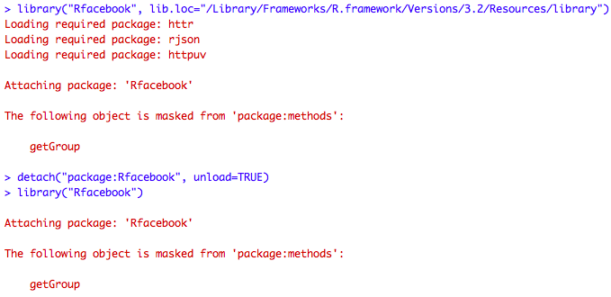

---
#Recordar que hay que guardar el archivo como UTF-8
#para que lea las tildes
---

---
title: "Sesión 1"
author: "T. Evgeniou (traducción: Eduardo Aguilar)"
output: html_document
---

<br>
 
Este documento es una adaptación en español del [archivo original](http://inseaddataanalytics.github.io/INSEADAnalytics/CourseSessions/Session1/Session1inclass.html) del curso de INSEADanalytics.


**Nota:** Para que su computadora pueda leer tildes y caracteres no ingleses deberá guardar el archivo en File --> "Save witrh encoding"--> UTF-8 y después compilarlo. Si usted quiere crear un archivo html puede hacerlo de dos formas: presionando el botón Knit o corriendo en la consola el comando *rmarkdown::render("Intro_basica.Rmd")*

Si tiene un error es posible que su directorio haya cambiado, en cuyo caso deberá ajustar los nombres de las carpetas.

El propósito de esta sesión es familiarizarse con:

1. Funcionalidades básicas de R;
2. Lectura/Escritura de información;
3. Manipulaciones de datos simples;
4. Gráficas simples;
5. La idea de funciones

Antes de empezar, asegúrese que ha descargado los archivos de la [sesión 1](https://github.com/InseadDataAnalytics/INSEADAnalytics/tree/master/CourseSessions/Session1)  en su repositorio de github (si descarga el repositorio del curso desde github usted también descarga las sesiones automáticamente). Para confirmar, usted también puede correr el archivo "update_fork.R" el cual se encuentra en el directorio principal del curso. 

Note que también manejar los directorios puede ser una frustrante y continua fuente de problemas, por lo que se recomienda aprender esos comandos de R para encontrar cual es su directorio de trabajo actual y, si es necesario, cambiar el directorio donde usted lo necesita (donde usted tiene los archivos de la clase). Por ejemplo, asumiendo que nos encontramos en la ubicación "MYDIRECTORY/INSEADAnalytics", podemos hacer lo siguiente: 

```{r echo=TRUE, eval=FALSE, tidy=TRUE}
# Este comando muestra el directorio donde nos encontramos (Nota: el caracter "#" al inicio de una línea de código indica que la línea no debe ser ejecutada y es sólo un comentario, por lo tanto debe ser removido para correr la línea:

#getwd()

# Este comando puede cambiar la ubicación del directorio si es necesario:
#setwd("C:/Users/eduardo_canas/Documents/R/INSEADAnalytics/CourseSessions/")
```


Comencemos.

**Nota:** usted puede siempre utilizar la función `help`en Rstudio para encontrar información acerca de cualquier función de R (por ejemplo escriba `help(list.files)` para poder leer lo que la el comando `list.files` hace).


<hr>

### Instalación

Primero, notemos que la estructura de este archivo cuando se abre en RStudio. Esto es llamado [archivo Markdown](http://rmarkdown.rstudio.com/) (con extensión .Rmd). Los archivos Markdown son excelentes maneras de crear reportes reproducibles, reutilizables y fáciles de modificar. Esto porque se puede combinar texto con código dentro del mismo archivo. El código puede ser insertado añadiendo *bloques de código* los cuales, como se describe abajo, son efectivamente porciones de código que empiezan con:

"```{r eval = TRUE, echo=TRUE, comment=NA, warning=FALSE, message=FALSE,results='markup'}""

y terminan con los mismos caracteres ```. 

Usted también puede empezar un bloque de código seleccionando la siguiente opción de RStudio


La cual generará el siguiente código


Cuando se compila el archivo se ejecuta todo el documento fusionando perfectamente los bloques de texto como los bloques de código R.

Usted puede crear un nuevo documento .Rmd seleccionando "R Markdown" como se muestra en la imagen:


En general, una vez se ha creado cualquier archivo, se le solicitará darle un nombre al archivo cuando trate de guardarlo por primera vez: 


Los archivos Markdown (extensión .Rmd) no son como los típicos archivos *R Script* (que terminan en .R). Los últimos sólo contienen código, así como funciones que deseamos construir. El archivo [example .R file](https://github.com/InseadDataAnalytics/INSEADAnalytics/blob/master/CourseSessions/Session1/library.R) es un ejemplo de un archivo puro de R. Uno puede incorporar archivos .R en el documento .Rmd simplemente añadiendolos, como se muestra a continuación:

```{r eval = FALSE, echo=TRUE, comment=NA, warning=FALSE, message=FALSE,results='asis'}
source("library.R")
```
Note que solo escribimos **library.R** porque el directorio contiene el archivo, si el archivo estuviera en otra ubicación usted no podría hacer esto, sino que debería especificar donde está ubicado.

Tenga en cuenta también que la estructura del [directorio sesión 1](https://github.com/InseadDataAnalytics/INSEADAnalytics/tree/master/CourseSessions/Session1). Todo lo que contiene (además de unos archivos de imágenes) es un archivo .Rmd, un .R y una carpeta donde guardamos los datos. Podemos crear carpetas nuevas usando la opción "New Folder".


#### Ejercicios

1. Cree un nuevo directorio adentro del folder "CourseSessions/Session1/" (por ejemplo lo puede llamar "Proyecto1"), y guarde en el un nuevo archivo .Rmd (por ejemplo "Proyecto1.Rmd"), un nuevo archivo .R (por ejemplo "library.r"), y un nuevo sub-directorio (llamelo "data") donde se guardará un archivo .csv (por ejemplo copie el archivo Boats.csv de la carpeta "data" de la sesión 1).

2. Añada el siguiente bloque de código en su archivo .Rmd

```{r eval = TRUE, echo=TRUE, comment=NA, warning=FALSE, message=FALSE,results='markup'}
ProjectData <- read.csv(file = "data/Boats.csv", header = TRUE, sep=",")
ncol(ProjectData)
```

3. ¿Qué sucede cuando se crea un archivo html pero con el nombre de su nuevo archivo .Rmd como argumento? 

**Su respuesta aquí:**

<br>
<br>

<hr>

### Añadiendo librerías

Uno de los mayroes beneficios de utilizar software libre es la impresionante disponibilidad de muchas funciones así como código que la gente desarrolla y comparte. Hay un rápido crecimiento de herramientas (libres) que se pueden utilizar (incluso en sus trabajos), y así evitar reinventar la rueda y subirse a la ola.

Hay muchas más formas de adquirir nuevas herramientas. Primero, las herramientas "maduras/probadas" están disponibles como paquetes que se pueden instalar en RStudio. Eche un vistazo aquí [lista de paquetes en R ](https://cran.r-project.org/web/packages/available_packages_by_name.html) y vea cuales le gustan.

Para instalar un paquete en R de click en el menú "Packages" y después en el botón "Install" y escriba el nombre del paquete que desea instalar, también seleccione la casilla "Install dependencies", como se indica en la imagen: 


Esto descargará el paquete (por lo tanto usted necesita estar conectado). Usted puede después cargar la librería ya sea seleccionándolaen la lista de paquetes instalados utilizando el comando `library` en R, por ejemplo veamos la librería de modelación financiera `library("quantmod")`. 






Una vez se tiene la librería se puede dar click en el (en el menú "Packages") para verificar los comandos disponibles (también disponible en la [lista de paquetes de R ](https://cran.r-project.org/web/packages/available_packages_by_name.html), por ejemplo en este caso para [documentación de quantmod).](https://cran.r-project.org/web/packages/quantmod/quantmod.pdf). Usted puede entonce explorar- siempre buscando en internet el código ejemplo (por ej: para [ejemplos quantmode](https://www.quantmod.com/examples/). 

```{r eval = FALSE, echo=TRUE, comment=NA, warning=FALSE, message=FALSE,results='asis'}
# Instale quantmod antes de ejecutar las siguientes líneas de código
#if (require(quantmod)==FALSE){install.packages("quantmod")} 

#Librería
library(quantmod)

#Obteniendo una tabla de precios del stock de Apple con precios de yahoo finance
getSymbols("AAPL",src="yahoo")

#Graficando los precios  
plot(AAPL$AAPL.Open)
```


**Nota:** Algunas librerías podrían requerir que reinicie RStudio o instale otro software o o reinicie totalmente su computadora. 

**Nota:** Hay maneras eficientes de instalar paquetes. Por ejemplo, uno puede usar algo como lo que usamos [en este código.](https://github.com/InseadDataAnalytics/INSEADAnalytics/blob/master/CourseSessions/Session1/library.R)


### Obteniendo código de Repositorios en Github

Un método alternativo para obtener código (y ver códigos de ejemplo - la mejor forma de aprender) es simplemente buscando en el vasto número de cuentas de github públicas. Por ejemplo, esta lista de [repositories de moda](https://github.com/trending?l=R) (toma tiempo crearlas!) o incluso el [mismo código fuente de R](https://github.com/wch/r-source) o por supuesto links de muchos otros [recursos en R](http://www.r-bloggers.com/tag/github/). Bienvenido a este nuevo mundo!

#### Preguntas

1. ¿Tiene usted, y en caso no, puede usted instalar estos paquetes? `datasets`, `FactoMineR`,`png` y `stringr`
2. Por favor encuentre un repositorio de github que usted quisiera explorar y añadir a su cuenta de github. ¿Cuálccionó?

<hr>
<hr>

### Leer/Escribir Datos

Ahora leamos ciertos datos. Hay muchas formas de hacerlo, incluyendo leer desde un archivo .csv usando los comandos `read.csv` y  `write.csv`. Aunque la forma "nativa" de leer y escribir datos en R es usando los comandos `save` y `load`. 

Leamos algunos datos de un archivo .csv desde ahora- asegúrese que descargó el repositorio de github de modo que tiene todos los archivos necesarios incluyendo los archivos csv. 

```{r eval = TRUE, echo=TRUE, comment=NA, warning=FALSE, message=FALSE,results='markup'}
ProjectData <- read.csv(file = "data/Boats.csv", header = TRUE, sep=",")
```

Veamos ahora que son estos datos. Corra los comandos para ver el número de filas, columnas, y los nombres de las filas y las columnas:

```{r eval = FALSE, echo=TRUE, comment=NA, warning=FALSE, message=FALSE,results='markup'}

# Cambie la parte donde dice r eval = FALSE por TRUE para poder ver los cambios en el documento HTML
ncol(ProjectData)
colnames(ProjectData)
colnames(ProjectData)[1:10]
#rownames(ProjectData) #ejecute esta línea bajo su propio riesgo pues tiene 2813 observaciones
```

¿Se ven esos datos igual que cuando usted abre el archivo .csv usando Excel? 

<hr>
<hr>

### Exploración de Datos: Un caso de segmentación de Mercado

A continuación se cargarán los datos del caso de estudio ["Botes (A): Un caso de Segmentación de Mercados "](http://inseaddataanalytics.github.io/INSEADAnalytics/Boats-A-prerelease.pdf) - usted puede ver la descripción de los datos en el apéndice (por supuesto los datos no son los verdaderos datos del negocio porque esos son confidenciales, pero tienen el mismo espíritu). El caso está basado en un verdadero proyecto de la compañía (líder en el mercado de botes) que hizo un análisis de segmentación de mercados para redefinir las estrategias de desarrollo de su marca y nuevos productos. La información de negocios relacionada al proyecto está en [Diapositivas Caso de estudio Segmentación de Mercados](http://inseaddataanalytics.github.io/INSEADAnalytics/BoatsSegmentationCaseSlides.pdf). Desarrollaremos esta solución de segmentación paso a paso utilizando las herramientas que discutiremos en las sesiones futuras - vea por ejemplo las herramientas de las [sesiones 2-3](https://github.com/InseadDataAnalytics/INSEADAnalytics/tree/master/CourseSessions/Sessions23) y también todos los apuntos de las sesiones 3-6.

Empecemos con una simple exploración de los datos por ahora. Obtengamos primero un resumen de estadísticas descriptivas. Por ejemplo la segunda columna (`r colnames(ProjectData)[2]`) tiene las siguientes estadísticas descriptivas:

```{r eval = TRUE, echo=TRUE, comment=NA, warning=FALSE, message=FALSE,results='markup'}
print(colnames(ProjectData)[2])
mean(ProjectData[,2])
sd(ProjectData[,2])
range(ProjectData[,2])
min(ProjectData[,2])
max(ProjectData[,2])
quantile(ProjectData[,2],0.1)
quantile(ProjectData[,2],0.5)
quantile(ProjectData[,2],0.9)
summary(ProjectData[,2])
```
 y el histograma 

```{r eval = TRUE, echo=TRUE, comment=NA, warning=FALSE, message=FALSE,results='markup'}
hist(ProjectData[,2], main = "Columna número 2", xlab = "Ratings", ylab = "Encuestados")
```

Podemos también ver cómo las respuestas de los entrevistados se relacionan con otras. Por ejemplo la matriz de correlación de las primeras 10 preguntas es:

```{r eval = TRUE, echo=TRUE, comment=NA, warning=FALSE, message=FALSE,results='markup'}
tmp = ProjectData[,2:10]
colnames(tmp) <- 2:10
print(round(cor(tmp),2))
```

La matriz de correlación no se ve muy bonita por ahora, pero veremos ejemplos de como hacerlo ver agradable más adelante (vea por ejemplo las tablas en los apuntes para las [sesiones 3-4](http://inseaddataanalytics.github.io/INSEADAnalytics/Report_s23.html)) - como siempre, hay muchas maneras de hacer excelentes visualizaciones en R, utilizando también Google Charts, vea algunos puntos de partida en los [recursos técnicos del curso.](http://inseaddataanalytics.github.io/INSEADAnalytics/TechResources.html)

#### Preguntas

1. ¿Puede encontrar cual columna corresponde a una variable binaria (solamente toma valores 0 ó 1)?
2. ¿Puede averiguar el rating promedio de la pregunta " `r gsub("_", " ", gsub("\\.", " ", "Q1_3_The.brand.of.boat.I.buy.says.a.lot.about.who.I.am"))` ?".
3. ¿Cuál de los siguientes paquetes de R o repositorios de github exploró y les parecieron interesantes?
4. *(Extra)* ¿Cuál es el porcentaje de hombres en esta población? ¿Cuántos de ellos respondieron que planean comprar un bote en el futuro?
5. Finalmente, una vez haya respondido todas las preguntas, por favor súbalo (commit-then-push) a su github(como se muestra en los pasos 3-5 del documento de [Getting Started Instructions](https://github.com/InseadDataAnalytics/INSEADAnalytics/wiki/Getting-Started))  así como todo otro archivo en el nuevo directorio que creó.

**Sus respuestas acá:**
<br>
<br>
<br>
<br>

<hr>
<hr>

Una vez acabemos esto, podemos movernos al [proyecto principal / documento que usaremos en clase](https://github.com/InseadDataAnalytics/INSEADAnalytics/blob/master/CourseSessions/InClassProcess) y asegurarnos que se puede crear un archivo html de él (ver también esta lista de [problemas](https://github.com/InseadDataAnalytics/INSEADAnalytics/issues/69) si es necesario).  

<br>
<br>
<br>
