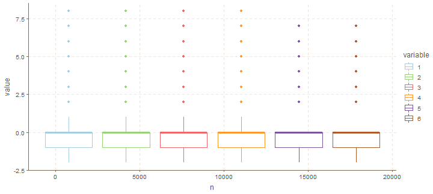
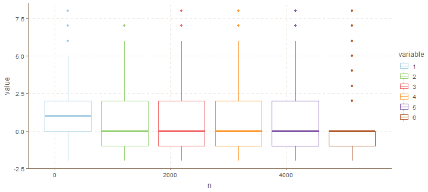
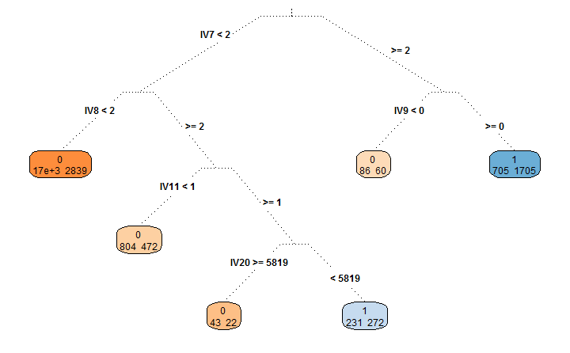
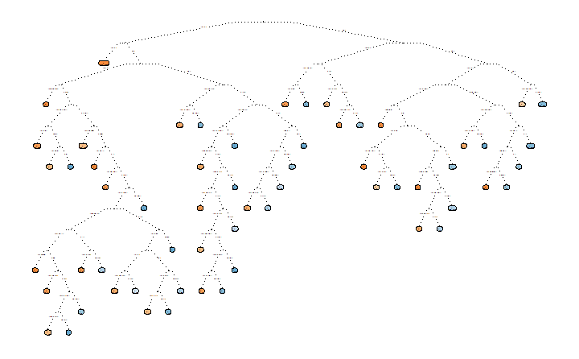
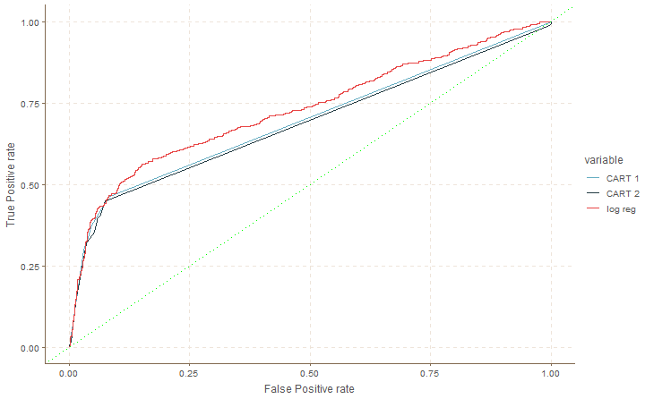
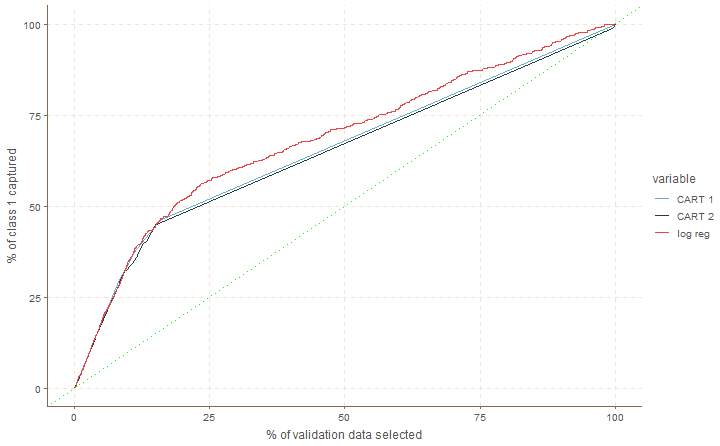
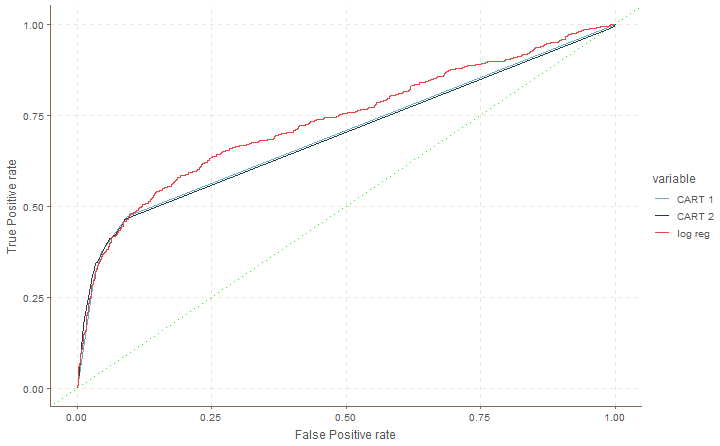
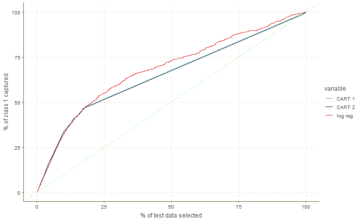
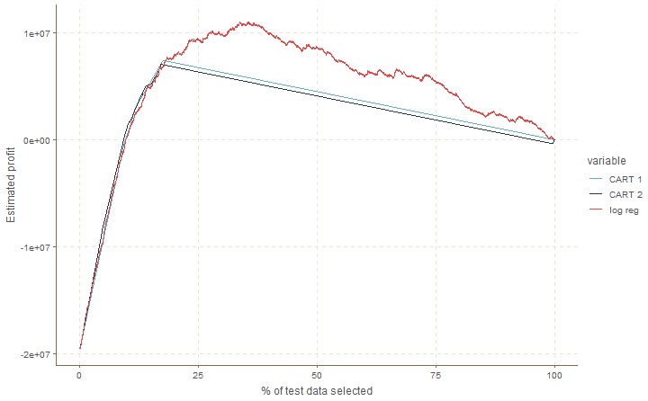

**Este caso ha sido traducido a español del curso de analítica aplicada de INSEAD. Puede encontrar la solución original en el archivo [Classification for Credit Default](http://inseaddataanalytics.github.io/INSEADAnalytics/CourseSessions/ClassificationProcessCreditCardDefault.html). El código original ha sufrido pocas modificaciones.**


# El Contexto de Negocios
Un emisor de tarjetas de crédito de Taiwan quiere mejorar la predicción de la probabilidad de impago de sus clientes, así como identificar las carcaterísticas clave que determinan esta probabilidad. Esto informaría al emisor acerca de a quien dar una tarjeta así como que límite dar. También ayudaría  al emisor a tener un mejor entendimiento de sus actuales y potenciales consumidores, lo cuál afectaría su futura estrategia, incluyendo sus planes de ofrecer productos crediticios específicos a sus consumidores.


<hr>\clearpage

# Los Datos
(Fuente: https://www.kaggle.com/uciml/default-of-credit-card-clients-dataset . Reconocemos lo siguiente:
Lichman, M. (2013). UCI Machine Learning Repository [http://archive.ics.uci.edu/ml]. Irvine, CA: University of California, School of Information and Computer Science.)

El emisor de tarjetas de crédito ha reunido información de 30000 consumidores. Los datos contienen información de 24 variables, incluyendo factores demográficos, datos de crédito, historial de pagos, y estados de cuenta de tarjetas de crédito desde Abril 2005 a Septiembre 2005, así como información del resultado: El cliente pagó o no?

Nombre                       | Descripción
:--------------------------|:--------------------------------------------------------------------
ID                         | ID de cada cliente
LIMIT_BAL                  | Monto del crédito en dólares (incluyendo créditos individuales y familiares/suplementarios)
SEX                        | Género (1=masculino, 2=femenino)
EDUCATION                  | (1=postgrado, 2=universidad, 3=bachillerato, 4=otros, 5=desconocido, 6=desconocido)
MARRIAGE                   | Estatus Marital (1=casado, 2=soltero, 3=otros)
AGE                        | Edad en años
PAY_0                      | Estatus de pago en Septiembre 2005 (-2=no consumo, -1=paga debidamente, 0=usa crédito rotativo, 1=atraso de un mes, 2=atraso de dos meses, ... 8=atraso de ocho meses, 9=atraso de nueve meses y más)
PAY_2                      | Estatus de pago en Agosto 2005 (misma escala)
PAY_3                      | Estatus de pago en Julio 2005 (misma escala)
PAY_4                      | Estatus de pago en Junio 2005 (misma escala)
PAY_5                      | Estatus de pago en Mayo 2005 (misma escala)
PAY_6                      | Estatus de pago en Abril 2005 (misma escala)
BILL_AMT1                  | Monto a pagar en Septiembre 2005 (dólares)
BILL_AMT2                  | Monto a pagar en Agosto 2005 (dólares)
BILL_AMT3                  | Monto a pagar en Julio 2005 (dólares)
BILL_AMT4                  | Monto a pagar en Junio 2005 (dólares)
BILL_AMT5                  | Monto a pagar en Mayo 2005 (dólares)
BILL_AMT6                  | Monto a pagar en Abril 2005 (dólares)
PAY_AMT1                   | Monto de pago anterior en Septiembre 2005 ( dólares)
PAY_AMT2                   | Monto de pago anterior en Agosto 2005 ( dólares)
PAY_AMT3                   | Monto de pago anterior en Julio 2005 ( dólares)
PAY_AMT4                   | Monto de pago anterior en Junio 2005 ( dólares)
PAY_AMT5                   | Monto de pago anterior en Mayo 2005 ( dólares)
PAY_AMT6                   | Monto de pago anterior en Abril 2005 ( dólares)
default.payment.next.month | Default (1=si, 0=no)

Veamos la información de unos pocos consumidores. Así es como las primeras 10 filas de un total de 30000 se ven (transpuestas, por conveniencia):


|          |    01|     02|    03|    04|    05|    06|     07|     08|     09|    10|
|:---------|-----:|------:|-----:|-----:|-----:|-----:|------:|------:|------:|-----:|
|ID        |     1|      2|     3|     4|     5|     6|      7|      8|      9|    10|
|LIMIT_BAL | 20000| 120000| 90000| 50000| 50000| 50000| 500000| 100000| 140000| 20000|
|SEX       |     2|      2|     2|     2|     1|     1|      1|      2|      2|     1|
|EDUCATION |     2|      2|     2|     2|     2|     1|      1|      2|      3|     3|
|MARRIAGE  |     1|      2|     2|     1|     1|     2|      2|      2|      1|     2|
|AGE       |    24|     26|    34|    37|    57|    37|     29|     23|     28|    35|
|PAY_0     |     2|     -1|     0|     0|    -1|     0|      0|      0|      0|    -2|
|PAY_2     |     2|      2|     0|     0|     0|     0|      0|     -1|      0|    -2|
|PAY_3     |    -1|      0|     0|     0|    -1|     0|      0|     -1|      2|    -2|
|PAY_4     |    -1|      0|     0|     0|     0|     0|      0|      0|      0|    -2|
|PAY_5     |    -2|      0|     0|     0|     0|     0|      0|      0|      0|    -1|
|PAY_6     |    -2|      2|     0|     0|     0|     0|      0|     -1|      0|    -1|
|BILL_AMT1 |  3913|   2682| 29239| 46990|  8617| 64400| 367965|  11876|  11285|     0|
|BILL_AMT2 |  3102|   1725| 14027| 48233|  5670| 57069| 412023|    380|  14096|     0|
|BILL_AMT3 |   689|   2682| 13559| 49291| 35835| 57608| 445007|    601|  12108|     0|
|BILL_AMT4 |     0|   3272| 14331| 28314| 20940| 19394| 542653|    221|  12211|     0|
|BILL_AMT5 |     0|   3455| 14948| 28959| 19146| 19619| 483003|   -159|  11793| 13007|
|BILL_AMT6 |     0|   3261| 15549| 29547| 19131| 20024| 473944|    567|   3719| 13912|
|PAY_AMT1  |     0|      0|  1518|  2000|  2000|  2500|  55000|    380|   3329|     0|
|PAY_AMT2  |   689|   1000|  1500|  2019| 36681|  1815|  40000|    601|      0|     0|
|PAY_AMT3  |     0|   1000|  1000|  1200| 10000|   657|  38000|      0|    432|     0|
|PAY_AMT4  |     0|   1000|  1000|  1100|  9000|  1000|  20239|    581|   1000| 13007|
|PAY_AMT5  |     0|      0|  1000|  1069|   689|  1000|  13750|   1687|   1000|  1122|
|PAY_AMT6  |     0|   2000|  5000|  1000|   679|   800|  13770|   1542|   1000|     0|

<hr>\clearpage


# Un proceso de Clasificación

> Es importante recordar que los proyectos de analítica requieren de un delicado balance entre experimentación e intuición, pero también siguiendo un proceso. El valor de seguir un proceso es para evitar ser engañado por la aleatoriedad en los datos y encontrar "patrones y resultados" que pueden estar explicados principalmente por nuestro propio sesgo y no por hechos/datos en sí. 
**No existe tal cosa cómo el mejor proceso** de clasificación. Sin embargo, tenemos que empezar por algo, así que haremos uso del siguiente proceso:

1. Crear un conjunto de estimación y dos conjuntos de evaluación dividiendo los datos en tres grupos. Los pasos 2-5 a continuación serán efectuados solo en el conjunto de estimación y el primer conjunto de validación. Usted debe efectuar el paso 6 una vez en el segundo conjunto de validación, llamado **datos de evaluación**, y reportar el desempeño en ese (segundo) conjunto sólo para tomar la decisión de negocios final.
2. Establecer la variable dependiente (como una variable categórica 0-1; clasificación múltiple también es posible, y similar, pero no exploraremos en eso en estos apuntes).
3. Hacer un diagnóstico preliminar acerca de la importancia relativa de las variables explicativas utilizando herramientas de visualización y simples estadísticas descriptivas.
4. Estimar el modelo de clasificación utilizando los datos de estimación, e interpretando los resultados.
5. Evaluar la precisión de la clasificación en el primer conjunto de validación, posiblemente repitiendo os pasos 2-5 unas cuantas veces en diferentes maneras para mejorar el desempeño.
6. Finalmente, evaluar la precisión de la clasificación en el segundo modelo de validación. Usted eventualmente usará/reportará todas las medidas y gráficas de desempeño solamente en el segundo conjunto de validación. 


Sigamos esos pasos.

## Paso 1: Dividir los datos
Es muy importante que usted mida y reporte (o espera ver de parte del científico de datos encargado del proyecto) el desempeño de su modelo en **datos que no han sido utilizados durante el análisis, estos son llamados "out-of-sample set", "test dataset" o "conjunto de evaluación"** (pasos 2-5). La idea es que en la práctica deseamos utilizar los modelos para predecir la clase de observaciones que no han sido observadas aún (por ejemplo "los datos futuros"): aunque el desempeño del método de clasificación puede ser alto en los datos utilizados para estimar los parámetros del modelo, este puede ser significativamente deficiente en datos que no han sido utilizados para calcularlo, como el **out-of-sample set** (datos futuros) en la práctica.

El segundo conjunto de validación representa esos datos, y el desempeño de este conjunto de validación es una mejor aproximación del desempeño que uno podría esperar del modelo seleccionado en la práctica. Esta es la razón porque dividimos los datos en un conjunto de estimación y dos conjuntos de dos conjuntos de validación, utilizando cierta técnica de selección aleatoria.  Los datos de estimación y el primer conjunto de datos de validación son utilizados en los pasos 2-5(con unas pocas iteraciones), mientras que el segundo conjunto de datos de validación sólo se utiliza una vez al final de todo antes de hacer la decisión de negocios final basada en el análisis. Esta división puede ser, por ejemplo, 80% datos de estimación, 10% validación y 10% evaluación, dependiendo del número de observaciones (por ejemplo, cuando hay muchos datos, usted puede preservar sólo unos pocos cientos de estos para los conjuntos de validación y evaluación, y el resto para la estimación).

Mientras se preparan los conjuntos de estimación y validación, usted puede también verificar que la proporción de las clases se mantenga estable, por ejemplo, que el porcentaje de personas que desean comprar un bote sea similar en ambos conjuntos, usted debe mantener el mismo balance de la variable dependiente cómo en los datos iniciales.

Por simplicidad, en estos apuntes **no** haremos iteraciones de los pasos 2-5. En la práctica, sin embargo, deberíamos iterar los pasos 2-5 unas cuantas veces utilizando el primer conjunto de validación cada vez, y hacer nuestra evaluación final del modelo utilizando el conjunto de evaluación sólo una vez.


A los tres conjuntos de datos se les denomina típicamente como **estimation_data** (conjunto de estimación 80%), **validation_data** (conjunto de validación 10%) y **test_data** (conjunto de evaluación 10%). 

En nuestro caso nosotros utilizamos24000 observaciones para el conjunto de estimación, 3000 en el conjunto de validación y 3000 en el conjunto de evaluación. 


## Paso 2: Elegir la variable dependiente

Primero, asegurarse que la variable dependiente ha sido definida como categórica 0-1. En este ejemplo ilustrativo, usamos el default (o no default) como nuestra variable dependiente.


Los datos, sin embargo, pueden no estar disponibles inmediatamente como variables categóricas. Supongamos una cadena minorista quiere entender que discrimina los consumidores leales de los que no lo son. Si ellos tienen datos de las cantidades que los consumidores gastan en su tienda o la frecuencia de sus compras, ellos pueden crear una variable categórica ("leal vs no leal") utilizando una definición como: "Un consumidor leal es aquel que gasta X cantidad en la tienda y hace al menos Y compras al año". Ellos pueden codificar con "1" a los consumidores leales y con "0" a los que no lo son.  Ellos también podrían establecer determinados límites de "X" e "Y", y esta decisión puede tener un impacto significativo en el análisis global. Esta decisión puede ser la más crucial de todo el análisis de datos: una selección incorrecta en este paso podría llevar a un desempeño pobre más adelante, así como ideas irrelevantes. Uno debería revisar varias veces la elección realizada en este paso, iterando los pasos 2-3 y 2-5.


> Decidir cuidadosamente la definición de la variable dependiente 0/1 puede ser la parte más crítica del proceso de clasificación. Esta decisión típicamente depende del conocimiento contextual y debe revisarse varias veces a lo largo de un proyecto de analítica de datos.

En nuestros datos, el número 0/1 del conjunto de estimación se distribuye de esta forma:


|                  | Class 1| Class 0|
|:-----------------|-------:|-------:|
|# of Observations |    5370|   18630|

mientras que en el conjunto de validación son:


|                  | Class 1| Class 0|
|:-----------------|-------:|-------:|
|# of Observations |     603|    2397|


## Paso 3: Análisis simple

La buena analítica de datos comienza con un buen conocimiento contextual, así como con análisis exploratorio simple y visualizaciones elementales. En el caso de la clasificación, uno puede explorar esas "clasificaciones simples"" evaluando como difieren las clases a lo largo de cualquiera de las variables independientes. Por ejemplo, estas son las estadísticas de nuestras variables independientes a lo largo de las dos clases, clase 1, "default":


|          |     min| 25 percent|  median|      mean| 75 percent|    max|       std|
|:---------|-------:|----------:|-------:|---------:|----------:|------:|---------:|
|ID        |       1|    6097.25| 11970.0|  11874.38|   17512.50|  24000|   6782.73|
|LIMIT_BAL |   10000|   50000.00| 90000.0| 129725.82|  200000.00| 740000| 115263.81|
|SEX       |       1|       1.00|     2.0|      1.59|       2.00|      2|      0.49|
|EDUCATION |       1|       1.00|     2.0|      1.89|       2.00|      6|      0.72|
|MARRIAGE  |       0|       1.00|     2.0|      1.53|       2.00|      3|      0.53|
|AGE       |      21|      27.00|    34.0|     35.52|      42.00|     73|      9.69|
|PAY_0     |      -2|       0.00|     1.0|      0.67|       2.00|      8|      1.38|
|PAY_2     |      -2|      -1.00|     0.0|      0.46|       2.00|      7|      1.51|
|PAY_3     |      -2|      -1.00|     0.0|      0.37|       2.00|      8|      1.51|
|PAY_4     |      -2|      -1.00|     0.0|      0.25|       2.00|      8|      1.50|
|PAY_5     |      -2|      -1.00|     0.0|      0.18|       2.00|      8|      1.48|
|PAY_6     |      -2|      -1.00|     0.0|      0.12|       0.00|      8|      1.49|
|BILL_AMT1 |   -6676|    3204.50| 19913.0|  47553.25|   57769.75| 610723|  71718.95|
|BILL_AMT2 |   -7334|    2823.75| 20250.0|  46522.80|   56489.00| 572834|  69956.13|
|BILL_AMT3 |  -61506|    2500.00| 19818.5|  44452.92|   52134.00| 578971|  67027.84|
|BILL_AMT4 |  -46627|    2305.25| 19068.5|  41230.76|   49233.00| 548020|  62688.03|
|BILL_AMT5 |  -46627|    1566.50| 18596.0|  39270.66|   47449.00| 547880|  60441.45|
|BILL_AMT6 | -339603|    1150.00| 18089.5|  37945.72|   46981.50| 472480|  58573.78|
|PAY_AMT1  |       0|       0.00|  1657.0|   3357.71|    3406.00| 300000|   9340.34|
|PAY_AMT2  |       0|       0.00|  1500.0|   3428.81|    3250.00| 358689|  12013.68|
|PAY_AMT3  |       0|       0.00|  1191.0|   3202.44|    3000.00| 234456|  10576.47|
|PAY_AMT4  |       0|       0.00|  1000.0|   3134.02|    2845.00| 432130|  11621.30|
|PAY_AMT5  |       0|       0.00|  1000.0|   3279.78|    3000.00| 332000|  12654.68|
|PAY_AMT6  |       0|       0.00|  1000.0|   3325.66|    2867.50| 345293|  13062.02|

y clase 0, "no default":


|          |     min| 25 percent|   median|      mean| 75 percent|     max|       std|
|:---------|-------:|----------:|--------:|---------:|----------:|-------:|---------:|
|ID        |       3|    5964.25|  12012.5|  12036.85|   18167.75|   23999|   6969.51|
|LIMIT_BAL |   10000|   60000.00| 150000.0| 175806.55|  250000.00| 1000000| 131059.41|
|SEX       |       1|       1.00|      2.0|      1.64|       2.00|       2|      0.48|
|EDUCATION |       0|       1.00|      2.0|      1.84|       2.00|       6|      0.80|
|MARRIAGE  |       0|       1.00|      2.0|      1.56|       2.00|       3|      0.52|
|AGE       |      21|      28.00|     34.0|     35.34|      41.00|      79|      9.15|
|PAY_0     |      -2|      -1.00|      0.0|     -0.20|       0.00|       8|      0.95|
|PAY_2     |      -2|      -1.00|      0.0|     -0.29|       0.00|       8|      1.04|
|PAY_3     |      -2|      -1.00|      0.0|     -0.30|       0.00|       8|      1.05|
|PAY_4     |      -2|      -1.00|      0.0|     -0.34|       0.00|       8|      1.01|
|PAY_5     |      -2|      -1.00|      0.0|     -0.38|       0.00|       7|      0.98|
|PAY_6     |      -2|      -1.00|      0.0|     -0.39|       0.00|       7|      1.02|
|BILL_AMT1 | -165580|    3731.50|  23119.5|  51474.20|   68187.50|  964511|  72893.67|
|BILL_AMT2 |  -69777|    3147.75|  21842.0|  49258.08|   64624.75|  983931|  70471.89|
|BILL_AMT3 | -157264|    2861.50|  20145.0|  46918.80|   60646.50| 1664089|  68518.18|
|BILL_AMT4 | -170000|    2350.25|  18889.5|  42696.05|   54019.75|  891586|  63178.42|
|BILL_AMT5 |  -81334|    1777.00|  17955.5|  40211.11|   50705.00|  927171|  60317.17|
|BILL_AMT6 | -150953|    1244.25|  16609.0|  38741.84|   49493.75|  961664|  59322.82|
|PAY_AMT1  |       0|    1158.00|   2423.0|   6172.79|    5556.00|  505000|  16297.18|
|PAY_AMT2  |       0|    1000.00|   2200.0|   6503.24|    5200.00| 1684259|  22660.15|
|PAY_AMT3  |       0|     500.00|   2000.0|   5478.54|    5000.00|  896040|  17330.59|
|PAY_AMT4  |       0|     390.00|   1700.0|   5207.40|    4566.00|  497000|  15667.78|
|PAY_AMT5  |       0|     371.00|   1734.5|   5216.92|    4581.25|  417990|  15918.86|
|PAY_AMT6  |       0|     268.50|   1663.5|   5726.61|    4500.00|  528666|  18707.41|

El propósito de dicho análisis de clases es obtener una idea inicial o una intuición de si las clases son en efecto separables, así como entender cuáles de las variables independientes tienen más poder discriminativo.

Notemos sin embargo que:

> Aunque cada variable independiente podría no diferir entre clases, la clasificación podrían aún ser posible: una combinación (lineal o no lineal) de variables independientes podría aún ser discriminativa.

Una simple herramienta de visualización que puede evaluar el poder discriminativo de las variables independientes es el **box plot** (diagrama de caja). Esa visualización representa simple resumen de las estadísticas de una variable independiente (media, mediana, máximo, mínimo, cuantiles, etc.) Por ejemplo, considere el box plot de nuestros datos para las variables de estatus de pago en la clase 1: 


```
## Warning: New theme missing the following elements: axis.ticks.length.x,
## axis.ticks.length.x.top, axis.ticks.length.x.bottom, axis.ticks.length.y,
## axis.ticks.length.y.left, axis.ticks.length.y.right
```



```
## Warning: New theme missing the following elements: axis.ticks.length.x,
## axis.ticks.length.x.top, axis.ticks.length.x.bottom, axis.ticks.length.y,
## axis.ticks.length.y.left, axis.ticks.length.y.right
```

y la clase 0:


```
## Warning: New theme missing the following elements: axis.ticks.length.x,
## axis.ticks.length.x.top, axis.ticks.length.x.bottom, axis.ticks.length.y,
## axis.ticks.length.y.left, axis.ticks.length.y.right
```



```
## Warning: New theme missing the following elements: axis.ticks.length.x,
## axis.ticks.length.x.top, axis.ticks.length.x.bottom, axis.ticks.length.y,
## axis.ticks.length.y.left, axis.ticks.length.y.right
```

**Preguntas:**

1. Dibuje los "box plot"" de las clases 1 y clase 0 para otro conjunto de variables independientes de su elección.
2. ¿Cuáles variables independientes parecen tener el mayor poder discriminativo?

**Respuestas:**

*
*


## Paso 4: Clasificación e Interpretación
Una vez se decide cuáles variables dependientes e independientes a utilizar (las cuáles pueden ser revisadas en iteraciones posteriores), uno puede usar un gran número de métodos de clasificación para desarrollar un modelo que pueda separar ambas clases.

> Algunos de los métodos de clasificación utilizados ampliamente son: árboles de clasificación y regresión (CART), boosted trees, support vector machines, redes neuronales, k vecinos más cercanos (KNN), regresión logística, lasso, bosques aleatorios, deep learning methods, etc. 

En estos apuntes, por simplicidad solamente vamos a considerar **regresión logística** y **árboles de decisión (CART)**. Sin embargo, reemplazar estos modelos por los otros es relativamente simple (aunque algún conocimiento de cómo funcionan esos métodos siempre es necesario- vea la ayuda de R para los métodos si es necesario). Entender cómo funcionan esos métodos va más allá del alcance de estos apuntes, pero hay muchas fuentes de información disponibles en línea para todos los métodos de clasificación.

La **regresión logística** es un método similar a una regresión lineal con la excepción que la variable dependiente es discreta (por ejemplo 0 o 1). La regresión logística lineal estima los coeficientes de un modelo lineal utilizando las variables independientes seleccionadas mientras se optimiza un criterio de clasificación. Por ejemplo, estos son los parámetros de la regresión logística para nuestros datos: 


|            | Estimate| Std. Error| z value| Pr(>&#124;z&#124;)|
|:-----------|--------:|----------:|-------:|------------------:|
|(Intercept) |     -0.6|        0.1|    -4.4|                0.0|
|ID          |      0.0|        0.0|    -0.3|                0.7|
|LIMIT_BAL   |      0.0|        0.0|    -3.6|                0.0|
|SEX         |     -0.1|        0.0|    -2.9|                0.0|
|EDUCATION   |     -0.1|        0.0|    -4.2|                0.0|
|MARRIAGE    |     -0.2|        0.0|    -4.8|                0.0|
|AGE         |      0.0|        0.0|     2.8|                0.0|
|PAY_0       |      0.6|        0.0|    29.1|                0.0|
|PAY_2       |      0.1|        0.0|     3.6|                0.0|
|PAY_3       |      0.1|        0.0|     3.0|                0.0|
|PAY_4       |      0.0|        0.0|    -0.4|                0.7|
|PAY_5       |      0.1|        0.0|     2.4|                0.0|
|PAY_6       |      0.0|        0.0|     0.2|                0.9|
|BILL_AMT1   |      0.0|        0.0|    -5.2|                0.0|
|BILL_AMT2   |      0.0|        0.0|     2.0|                0.0|
|BILL_AMT3   |      0.0|        0.0|     0.6|                0.5|
|BILL_AMT4   |      0.0|        0.0|     0.5|                0.6|
|BILL_AMT5   |      0.0|        0.0|     0.7|                0.5|
|BILL_AMT6   |      0.0|        0.0|    -0.3|                0.8|
|PAY_AMT1    |      0.0|        0.0|    -5.8|                0.0|
|PAY_AMT2    |      0.0|        0.0|    -3.6|                0.0|
|PAY_AMT3    |      0.0|        0.0|    -2.3|                0.0|
|PAY_AMT4    |      0.0|        0.0|    -1.6|                0.1|
|PAY_AMT5    |      0.0|        0.0|    -0.9|                0.4|
|PAY_AMT6    |      0.0|        0.0|    -2.2|                0.0|

Dado un conjunto de variables independientes, el resultado de la regresión logística esperada (la suma de productos de las variables independientes con los correspondientes coeficientes de la regresión) puede ser utilizada para evaluar la probabilidad de que una observación pertenezca a determinada clase. Específicamente, el resultado de la regresión puede ser transformado en una probabilidad de pertenecer a, digamos, la clase 1 de cada observación. La probabilidad estimada de que una observación pertenece a la clase 1 en nuestro conjunto de validación (por ejemplo, probabilidad de default) para las primeras observaciones utilizando la regresión logística es:


|       | Actual Class| Predicted Class| Probability of Class 1|
|:------|------------:|---------------:|----------------------:|
|Obs 1  |            0|               1|                   0.50|
|Obs 2  |            1|               0|                   0.21|
|Obs 3  |            0|               0|                   0.18|
|Obs 4  |            0|               1|                   0.89|
|Obs 5  |            0|               0|                   0.16|
|Obs 6  |            0|               0|                   0.19|
|Obs 7  |            0|               0|                   0.18|
|Obs 8  |            0|               0|                   0.19|
|Obs 9  |            0|               0|                   0.16|
|Obs 10 |            0|               0|                   0.24|

La decisión tradicional es clasificar cada observación en el grupo con la mayor probabilidad, pero uno puede cambiar esa decisión, como veremos más adelante.

Seleccionar el mejor subconjunto de variables independientes para la regresión logística, un caso especial del problema general de **selección de variables**, es un proceso iterativo donde se toman en cuenta tanto la significancia de los coeficientes de la regresión como el desempeño del modelo en el primer conjunto de validación. Unas cuantas variantes son evaluadas en la práctica, cada una terminando en diferentes resultados.


**CART** es un método ampliamente utilizado porque el modelo de clasificación estimado es fácil de interpretar. Esta herramienta de clasificación divide iterativamente los datos usando la variable independiente más discriminativa en cada paso, construyendo un árbol (cómo se muestra más adelante) en el camino. Los métodos CART **limitan el tamaño del árbol** utilizando varias técnicas estadísticas para evitar el **sobreajuste**. Por ejemplo, utilizando las funciones rpart y rpart.control de R, podemos limitar el tamaño del árbol seleccionando las funciones **complexity control** parámetro **cp** (lo que esto hace va más allá del alcance de estos apuntes. Para las funciones rpart y rpart.control en R, pequeños valores, por ejemplo cp=0.001, conducen a árboles más grandes, como veremos más adelante).


> Uno de los riesgos más grande cuando se construye un modelo de clasificación es el sobreajuste (overfitting): mientras siempre sea trivial construir un modelo (por ejemplo un árbol) que clasifique cualquier conjunto (estimación)  de datos de manera perfecta sin ningún error, pero no se garantiza que la calidad del clasificador en el conjunto de validación sea cercana a la del conjunto de validación. Encontrar el balance correcto entre "sobreajuste" y "desajuste" (**overfitting** y **underfitting**) es uno de los aspectos más importantes de la analítica de datos. Aunque existen algunas técnicas estadísticas que nos ayudan a encontrar ese balance (incluyendo el conjunto de validación) es más una combinación de buen análisis estadístico y buen criterio cualitativo (con respecto a la simplicidad o interpretabilidad de los modelos estimados) la que nos llevará a construir modelos de clasificación que funcionen bien en la práctica.

Al implementar un modelo CART con complexity control cp=0.0025,  nos lleva al siguiente árbol(**NOTA**: para mejor visibilidad del árbol,  llamaremos a las variables independientes IV1 a IV24 cuando se use un CART):



Las hojas del árbol indican el número de observaciones del conjunto de estimación que pertenecen a cada clase y alcanzan "esa hoja". Una clasificación perfecta sólo tendría un dato de cada clase en cada hoja. Sin embargo, una clasificación tan perfecta es más propensa o no clasificar bien los datos de validación debido al sobreajuste en los datos de estimación.


Uno puede estimar árboles más grandes cambiando el parámetro **complexity control** del modelo (en este caso rpart.control argument cp). Por ejemplo, así es como se vería un árbol con cp=0.00068:


```
## Warning: labs do not fit even at cex 0.15, there may be some overplotting
```



Uno puede también usar el porcentaje de datos en cada hoja del árbol para tener una probabilidad estimada de las observaciones que pertenecen a esa clase. La **pureza de la hoja** puede indicar la probabilidad de que una observación que alcanza una hoja pertenezca a determinada clase. En nuestro caso, la probabilidad de nuestros datos de validación de pertenecer a la clase 1(por ejemplo, que un cliente hará default) para las primeras observaciones, usando el CART de arriba es:


|       | Actual Class| Predicted Class| Probability of Class 1|
|:------|------------:|---------------:|----------------------:|
|Obs 1  |            0|               1|                   0.71|
|Obs 2  |            1|               0|                   0.14|
|Obs 3  |            0|               0|                   0.14|
|Obs 4  |            0|               1|                   0.71|
|Obs 5  |            0|               0|                   0.14|
|Obs 6  |            0|               0|                   0.14|
|Obs 7  |            0|               0|                   0.14|
|Obs 8  |            0|               0|                   0.14|
|Obs 9  |            0|               0|                   0.14|
|Obs 10 |            0|               0|                   0.14|

La tabla de arriba asume un **umbral de probabilidad** para considerar una observación como parte de la "clase 1" de 0.5. En la práctica necesitamos seleccionar un umbral de probabilidad: esta es una decisión muy importante que discutiremos más adelante.

**Pregunta:**

Calcule el CART con un parámetro de complejidad de cp=0.0001 o menor. ¿Es práctico correrlo? ¿Es práctico interpretarlo? ¿Confía en el clasificador?

**Respuesta:**

*


Ya hemos discutido la selección de variables y control de complejidad para los métodos de clasificación. En nuestro caso podemos ver la importancia relativa de las variables independientes la `variable.importance` de los árboles de decisión (ver `help(rpart.object)` en R) o los valores de Z para la regresión logística. Para visualizarlo más fácil, se escalaron los valores entre -1 y 1 (la escala se hace para cada método de forma separada, note que CART no entrega el signo de los coeficientes). De esta tabla podemos ver los **factores clave** de la clasificación de acuerdo a cada modelo.


|          | Logistic Regression| CART 1| CART 2|
|:---------|-------------------:|------:|------:|
|ID        |               -0.01|   0.00|  -0.02|
|LIMIT_BAL |               -0.12|   0.00|  -0.01|
|SEX       |               -0.10|   0.00|   0.00|
|EDUCATION |               -0.14|   0.00|  -0.01|
|MARRIAGE  |               -0.16|   0.00|   0.00|
|AGE       |                0.10|   0.00|   0.02|
|PAY_0     |                1.00|   1.00|   1.00|
|PAY_2     |                0.12|   0.23|   0.23|
|PAY_3     |                0.10|   0.06|   0.07|
|PAY_4     |               -0.01|  -0.05|  -0.06|
|PAY_5     |                0.08|   0.06|   0.07|
|PAY_6     |                0.01|   0.04|   0.05|
|BILL_AMT1 |               -0.18|   0.00|  -0.03|
|BILL_AMT2 |                0.07|   0.01|   0.04|
|BILL_AMT3 |                0.02|   0.00|   0.04|
|BILL_AMT4 |                0.02|   0.00|   0.04|
|BILL_AMT5 |                0.02|   0.00|   0.04|
|BILL_AMT6 |               -0.01|   0.00|  -0.04|
|PAY_AMT1  |               -0.20|   0.00|  -0.01|
|PAY_AMT2  |               -0.12|   0.00|  -0.02|
|PAY_AMT3  |               -0.08|   0.00|  -0.02|
|PAY_AMT4  |               -0.05|   0.00|  -0.02|
|PAY_AMT5  |               -0.03|   0.00|  -0.01|
|PAY_AMT6  |               -0.08|   0.00|  -0.02|

En general, no es necesario que todos los modelos coincidan en los factores más importantes: cuando hay una diferencia mayor, particularmente entre modelos que tengan resultados satisfactorios como discutiremos después, podríamos necesitar cambiar el análisis global, incluyendo el objetivo del análisis, así como los datos usados, ya que los resultados podrían no ser robustos. **Como siempre, interpretar y usar los resultados de analítica de datos requiere un balance entre análisis cuantitativo y cualitativo.**


## Paso 5: Precisión del conjunto de validación.

Utilizando las probabilidades de las predicciones del conjunto de validación, cómo se mencionó antes, se pueden generar medidas de desempeño de la clasificación. Antes de discutirlas, notemos que, dada la probabilidad de pertenecer a una clase, **una opción de predicción razonable sería simplemente predecir la clase que tenga la probabilidad de ocurrencia más alta (o la más frecuente)**. Sin embargo, esta no tiene que ser la única opción en la práctica.

> Seleccionar un umbral de probabilidad para decidir la clase a la que pertenece una observación es una decisión importante que el usuario debe hacer. Mientras en algunos casos una probabilidad razonable es 50%, en otros debería ser 99.9% o 0.01%. ¿pueden pensar acerca de esos casos?

**Preguntas:**

1. Puede pensar sobre tal escenario:
2. ¿Qué límite de probabilidad usted piensa que haría más sentido en el caso de default en tarjetas de crédito?

**Respuestas:**

*
*

Para diferentes opciones de umbral de probabilidad, uno puede medir varias métricas de desempeño, las cuales se describen a continuación.

### 1.  Proporción de aciertos (Hit ratio)
Es simplemente el porcentaje de observaciones que han sido correctamente clasificadas (la clase predecida es la clase real). Podemos simplemente contar el número de datos de validación clasificados correctamente y dividir ese número entre el número total de observaciones del conjunto de validación, utilizando dos CART y una regresión logística. Los siguientes son los porcentajes de acierto utilizando un umbral de probabilidad de 50%:


|                    | Hit Ratio|
|:-------------------|---------:|
|Logistic Regression |  82.50000|
|First CART          |  83.63333|
|Second CART         |  83.40000|
Mientras que para los datos de estimación, las tasas de precisión son:

|                    | Hit Ratio|
|:-------------------|---------:|
|Logistic Regression |   80.8750|
|First CART          |   81.9625|
|Second CART         |   83.1000|

Un simple punto de referencia para comparar el desempeño de un modelo de clasificación es el **criterio de la máxima oportunidad**. Este mide la proporción de la clase más grande. Para nuestros datos de validación el grupo más grande son las personas que no entran en default: 2397 de 3000 personas. Claramente, si clasificamos todos los individuos dentro del grupo más grande, podemos tener una tasa de aciertos del 79.9%, sin hacer ningún trabajo. Uno puede alcanzar al menos una tasa de aciertos de al menos la máxima oportunidad, aunque como veremos más adelante aún hay más criterios de desempeño a considerar.


### 2. Matriz de Confusión.

La matriz de confusión muestra el número de datos que ha sido clasificado correctamente para cada clase. Por ejemplo, para el método con la tasa de aciertos más alta en los datos de validación (entre la regresión logística y los dos modelos CART), y para un umbral de probabilidad del 50%, la matriz de confusión es:


|                      | Predicted 1 (default)| Predicted 0 (no default)|
|:---------------------|---------------------:|------------------------:|
|Actual 1 (default)    |                 34.66|                    65.34|
|Actual 0 (no default) |                  4.05|                    95.95|

**Preguntas:**

1. Note que los porcentajes suman 100% para cada fila. ¿Por qué?
2. Además, una "buena" matriz de confusión debe tener grandes valores en su diagonal y pequeños valores en las otras posiciones. ¿Por qué?

**Respuestas:**

*
*


### 3. Curva ROC.

Recuerde que cada observación es clasificada por nuestro modelo de acuerdo a las probabilidades Pr(0) y Pr(1) y un determinado umbral de probabilidad. Comúnmente se establece el umbral de probabilidad en 0.5 (así que las observaciones con Pr(1)>0.5 son clasificadas como 1). Sin embargo, podemos variar este umbral, por ejemplo si estamos interesados en clasificar correctamente todos los 1's pero no nos interesa perder los 0's (y viceversa).

Cuando cambiamos el umbral de probabilidad obtenemos diferentes valores de proporción de aciertos, falsos positivos, falsos negativos, o cualquier otra medida de desempeño. Podemos graficar, por ejemplo, cómo cambian los falsos positivos vs los verdaderos positivos a medida cambiamos el umbral de probabilidad, y generamos la curva ROC.

Las curvas ROC para los datos de validación para ambos CARTs arriba así como para la regresión logística son:



¿Cómo debería verse una buena curva ROC? La regla básica para evaluar una curva ROC es que entre más "alta" mejor, porque el área bajo la curva es más grande. Usted podría también seleccionar un punto en la curva ROC (el mejor para nuestro propósito) y utilizar que el desempeño de los falsos positivos y falsos negativos (y su correspondiente umbral para P(1)) para evaluar el modelo.

**Preguntas:**

1. ¿Que punto en la curva ROC seleccionaría?
2. ¿A qué clasificador corresponde la línea punteada de 45°? ¿Cómo muestra la curva ROC que tanto la regresión logística como modelos CART son superiores a dicho clasificador?


**Respuestas:**

*
*

### 4. Curva Gains
La curva Gains es una técnica popular en ciertas aplicaciones, cómo en marketing o riesgo de crédito. 

Como un ejemplo concreto, considere el caso de una campaña de marketing por correo. Digamos que tenemos un clasificadorque intenta identificar las personas que si responderán a la encuesta. Nosotros quisieramos seleccionar los menos casos posibles y aún así capturar el máximo número de encuestas posibles.

Podemos medir el porcentaje de todas las respuestas que el clasificador captura, digamos, x% de los casos: el mejor x% en términos de probabilidad de respuesta asignada por nuestro clasificador. Para cada porcentaje de los casos que seleccionamos (x), podemos graficar el siguiente punto: el eje-x será el porcentaje de todos los casos que fueron seleccionados, mientras que el eje-y será el porcentaje de todos los casos pertenecientes a la clase 1 de los que fueron seleccionados (la proporción de verdaderos positivos/ predecidos positivos de nuestro clasificador, asumiendo que el clasificador predice clase 1 para todos los casos, y predice clase 0 para los restantes). Si graficamos esos puntos mientras cambiamos el porcentaje de cases seleccionados (x) (mientras se cambia el umbral de probabilidad del clasificador), obtenemos una gráfica llamada la **curva gains**. 

En el caso de default de tarjetas de crédito, la curva gains para los datos de validación de nuestros tres clasificadores son las siguientes:



Note que si fuéramos a examinar casos aleatorios, en lugar de seleccionar los "mejores" usando un clasificador informado, la "predicción aleatoria" de la curva gains sería una línea recta de 45 grados.

**Pregunta:**

¿Por qué?

**Respuesta:**

*
¿Cómo debería verse una buena curva gains? Entre más arriba de la línea de 45° esté nuestra curva gains, mejor. Además, así como la curva ROC, uno puede seleccionar el porcentaje de los casos de todos los casos a examinar apropiadamente de modo que en cualquier punto de la curva gains sea seleccionado.

**Pregunta:**

¿Cuál punto de la curva gains deberíamos seleccionar en la práctica?

**Respuesta:**

*

### 5. Curva de Ganancias

Finalmente, podemos generar la llamada curva de ganancias, la cual se utiliza frecuentemente para tomar la decisión final. Considere una campaña directa de marketing, y suponga el $costo de enviar publicidad como 1, y una ganancia esperada de una persona que responde positivamente de $45. Suponga que tiene una base de datos de 1 millón de personas a las que se les puede potencialmente enviar publicidad.  Las típicas tasas de respuesta son 0.05%. ¿Qué fracción del millón de personas debería enviarle la publicidad? 

Para responder este tipo de preguntas necesitamos crear la **curva de ganancias**. Podemos medir cierta métrica de ganancias si solo seleccionamos los mejores casos en términos de probabilidad de respuesta asignada por nuestro clasificador. Luego podemos graficar la curva de ganancias mientras cambiamos el porcentaje de casos seleccionados así como hicimos con la curva gains, y calculando la correspondiente **ganancia estimada** (o pérdida). Esto es simplemente igual a:

> Ganancia total esperada = (% de 1's correctamente predecidos) x (valor de capturar un 1) + (% de 0's correctamente predecidos) x (valor de capturar un 0) + (% de 1's incorrectamente predecidos como 0) x (valor de perder un 1) + (% de 0's incorrectamente predecidos como 1) x (valor de perder un 0)

> Calcular la ganancia esperada requiere de tener una estimación de los cuatro valores: valor de capturar un 0 o 1, y costo de perder un 0 o 1 o viceversa.

Dados los valores y costos de clasificar correcta e incorrectamente, podemos graficar la ganancia total esperada (o pérdida) a medida cambiamos el porcentaje de casos seleccionados, por ejemplo cuando usamos el umbral de probabilidad como cuando generamos las curvas ROC. 

En el caso de riesgo de crpedito, nosotros consideramos las siguientes pérdidas y ganancias por clasificar a los clientes:


|                      | Predict 1 (default)| Predict 0 (no default)|
|:---------------------|-------------------:|----------------------:|
|Actual 1 (default)    |                   0|                 -1e+05|
|Actual 0 (no default) |                   0|                  2e+04|

Basado en esos estimados de ganancias y pérdidas, las curvas de ganancias para los datos de validación de los tres clasificadores son:


Podemos ahora seleccionar el porcentaje de casos seleccionados que corresponde la máxima ganancia estimada (o pérdida mínima, si es necesario).


**Pregunta:**

¿Qué punto de la curva de ganancia debería seleccionar en la práctica?

**Respuesta:**

*

Notemos que para maximizar la ganancia esperada necesitamos tener una estimación de la ganancia o pérdida para cada uno de los cuatro escenarios! Esto puede ser difícil de evaluar, por lo que normalmente se necesita realizar cierto análisis de sensibilidad a las ganancias y pérdidas que han sido asumidas. Por ejemplo, podemos generar diferentes curvas de ganancia (el peor caso, el mejor caso, y el caso promedio) y ver cuánto varía la mejor ganancia, y más importante ver **como varía nuestro modelo de clasificación y umbral de probabilidad correspondiente a la mejor ganancia**, ya que es lo que eventualmente debemos decidir.


## Paso 6: Precisión del modelo

Habiendo iterado los pasos 2-5 hasta que estemos satisfechos con el desempeño del modelo en los datos de validación, en este paso necesitamos hacer el análisis del desempeño hecho en el paso 5 para los datos de evaluación (test set). Esta es la medida de desempeño que mejor representa lo que uno esperaría en la práctica una vez implementada la solución, **asumiendo (como siempre) que los datos utilizados en el análisis son representativos de la situación en la que será implementado el sistema.**

Veamos en nuestro caso la **hit ratio, matriz de confusión, curva ROC, curva gains, y curva de ganancias** para los datos de evaluación. Para el the hit ratio y la matriz de confusión usamos 50% como el umbral de probabilidad de la clasificación.


|                    | Hit Ratio|
|:-------------------|---------:|
|Logistic Regression |  81.16667|
|First CART          |  82.43333|
|Second CART         |  82.70000|

La matriz de confusión para el modelo con la mejor proporción de aciertos en nuestros datos de validación:


|                      | Predicted 1 (default)| Predicted 0 (no default)|
|:---------------------|---------------------:|------------------------:|
|Actual 1 (default)    |                 34.69|                    65.31|
|Actual 0 (no default) |                  3.68|                    96.32|

Curva ROC para los datos de evaluación:



Curva Gains para los datos de evaluación:



Finalmente, curva de ganancias para los datos de evaluación, usando las mismas estimaciones de pérdidas y ganancias que hicimos arriba:



**Preguntas:**

1. ¿Es el desempeño en los datos de evaluación similar al desempeño en los datos de validación? ¿Deberíamos esperar que el desempeño de nuestra clasificación sea cercano al que se obtienen en los datos de evaluación cuando se implementa en producción? ¿Porqué o porqué no? ¿Que deberíamos hacer si son diferentes?
2. Haga una evaluación final acerca de cuál clasificador debería ser usado (de los considerados aquí) para la clasificación de default en tarjetas de crédito, con qué porcentaje de casos/umbral de probabilidad, y diga la razón. ¿Cuál es la ganancia que la compañía podría lograr (como se midió con los datos de evaluación) basado en su solución?
3. ¿Qué tanto depende su evaluación de los valores de correcta o incorrectamente clasificar (0, 10<sup>5</sup>, 0, 2 &times; 10<sup>4</sup>)?
4. ¿Cuál decisión de negocios puede hacer el emisor de tarjetas de crédito basado en este análisis?


**Respuestas:**

*
*
*
*
